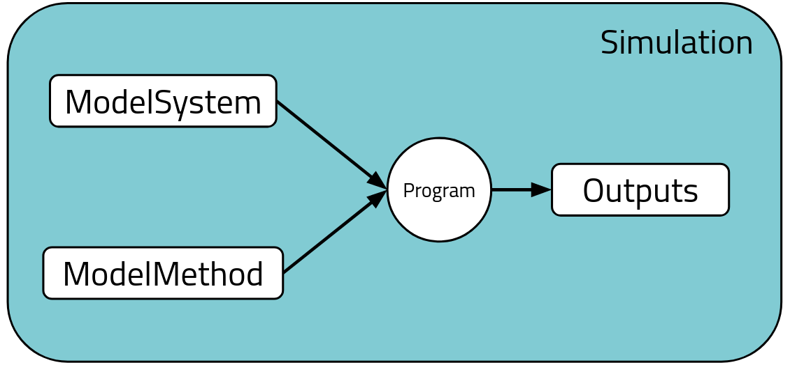

# `Simulation` base class

We defined a base class named `Simulation`. You can find its Python schema definition in [src/nomad_simulations/general.py](https://github.com/nomad-coe/nomad-schema-plugin-simulation-data/blob/develop/src/nomad_simulations/general.py#L168). In NOMAD, this section will
appear under the **_data_** section for the _archive_ of each _entry_.

In NOMAD, a set of [base sections](https://nomad-lab.eu/prod/v1/staging/docs/howto/customization/base_sections.html) derived from the [Basic Formal Ontology (BFO)](https://basic-formal-ontology.org/) are defined. We used them to define `Simulation` as an [`Activity`](http://purl.obolibrary.org/obo/BFO_0000015). The UML diagram is:

<div class="click-zoom">
    <label>
        <input type="checkbox">
        
    </label>
</div>

The detailed UML diagram of quantities and functions defined for `Simulation` is:

<div class="click-zoom">
    <label>
        <input type="checkbox">
        
    </label>
</div>

We use double inheritance from `EntryData` in order to populate the `data` section in the NOMAD archive. All of the base classes discussed here are subject to the [public normalize function](normalize.md) in NOMAD. The private function `set_system_branch_depth()` is related with the [ModelSystem base class](model_system/model_system.md).

## Main sub-sections in `Simulation`

The `Simulation` base class is composed of 4 main sub-sections:

1. `Program`: contains all the program information, e.g., `name` of the program, `version`, etc.
2. `ModelSystem`: contains all the system information about geometrical positions of atoms, their states, unit cells, symmetry information, etc.
3. `ModelMethod`: contains all the methodological information, and it is divided in two main aspects: the model Hamiltonian or approximation used in the simulation (e.g., DFT, GW, ForceFields, etc.) and the numerical settings used to compute the properties (e.g., meshes, self-consistent conditions, basis sets, etc.).
4. `Outputs`: contains all the output properties, as well as references to the `ModelSystem` and `ModelMethod` used to obtain such properties. It might also contain information which will populate `ModelSystem` (e.g., atomic occupations, atomic moments, crystal field energies, etc.).

!!! note "Self-consistent steps, SinglePoint entries, and more complex workflows."
    In NOMAD, we consider the minimal unit for storing the data in the archive (i.e., an *entry*) as any calculation containing all the self-consistent steps of itself. This is what we call, `SinglePoint`. Thus, we do not split each self-consistent step in its own entry in the NOMAD archive, but rather store them under the same entry in the archive. Any other complex calculation which combines several differentiated self-consistent calculations must be considered a **workflow** (e.g., a `GW` calculation is usually composed of 2 `SinglePoint` entries: the `DFT SinglePoint` self-consistent calculation + the `GW SinglePoint` self-consistent calculations). You can check the [NOMAD simulations workflow schema](https://github.com/nomad-coe/nomad-schema-plugin-simulation-workflow) for more information.

The simplified schematics for a `Simulation` data section will then be:

<div class="click-zoom">
    <label>
        <input type="checkbox">
        
    </label>
</div>

### `Program`

The `Program` base class section contains all the information about the program / software / code used to perform the simulation. We considered to be a [`(Continuant) Entity`](http://purl.obolibrary.org/obo/BFO_0000002). The detailed UML diagram is:

<div class="click-zoom">
    <label>
        <input type="checkbox">
        
    </label>
</div>

When [writing a parser](https://nomad-lab.eu/prod/v1/staging/docs/howto/customization/parsers.html), we recommend to start by instantiating the `Program` section and populating its quantities to get acquaintant and learn how to use the NOMAD infrastructure. For example:


<!-- Maybe better to have a more direct and standalone example even if it is a dummy text which is then passed using TextParser?-->

```python
from nomad.parsing.file_parser import XMLParser, TextParser
from nomad_simulations import Simulation, Program


class VASPParser:
    """
    Class responsible to populate the NOMAD `archive` from the files given by
    a VASP simulation.
    """

    def parse(self, filepath, archive, logger):
        # Note that we are skipping part of the logic for simplicity here. In
        # this case, `main_output_parser` contains logic to recognized the XML
        # mainfile output by VASP, and if this is not present in an upload, it
        # will fallback to the OUTCAR mainfile output. The `key` defined for
        # `main_output_parser.header` should be defined using the corresponding
        # XML or  Text parser classes.
        if filepath.endswith('xml'):
            main_output_parser = XMLParser()
        elif filepath.endswith('OUTCAR'):
            main_output_parser = TextParser()
        else:
            logger.error(f'Parser {filepath} not recognized by `VASPParser`.')
            return
        main_output_parser.mainfile = filepath

        version = ' '.join(
            [
                main_output_parser.header.get(key, '')
                for key in ['version', 'subversion', 'platform']
            ]
        ).strip()
        simulation = Simulation()
        simulation.program = Program(
            name='VASP',
            version=version,
        )
```
