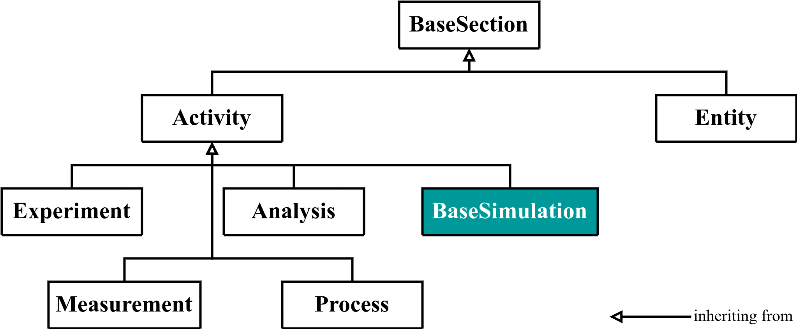
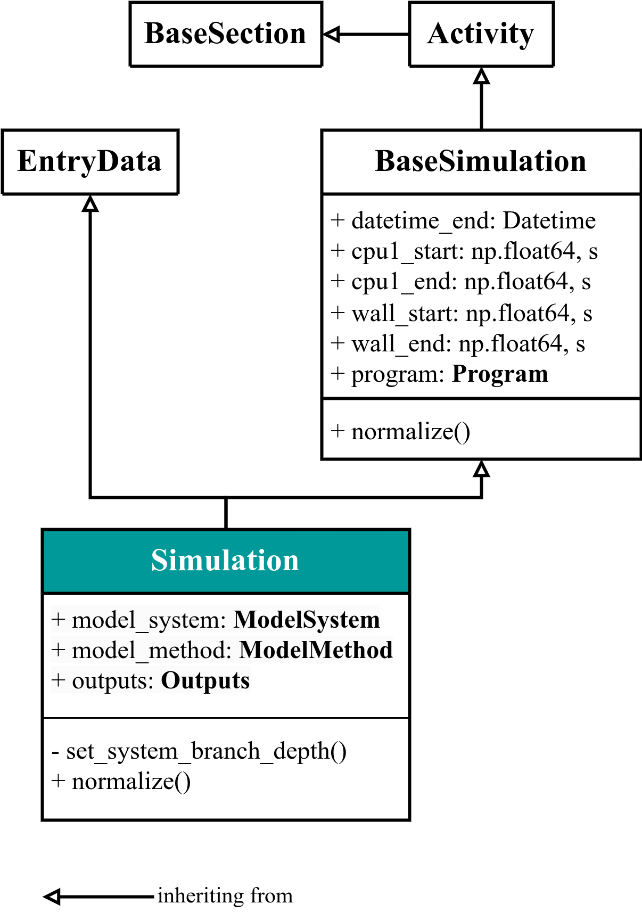
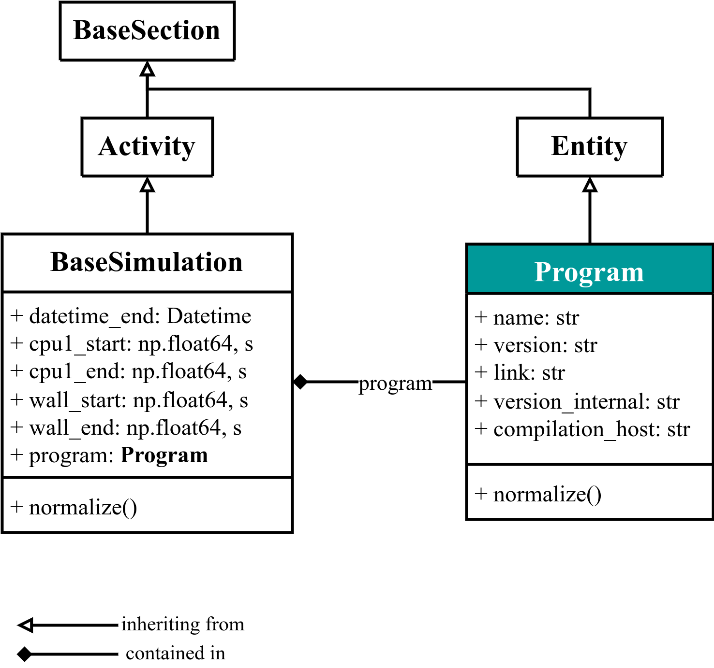

# `Simulation` base class

<!--
Improve these paragraphs once `Program` and `BaseSimulation` are integrated in `basesections.py`
--->
In NOMAD, all the simulation metadata is defined in the `Simulation` section. You can find its Python schema definition in [src/nomad_simulations/general.py](https://github.com/nomad-coe/nomad-schema-plugin-simulation-data/blob/develop/src/nomad_simulations/general.py). This section will appear under the `data` section for the _archive_ metadata structure of each _entry_.

The `Simulation` section is derived from a _base section_ `BaseSimulation`. In NOMAD, set of [base sections](https://nomad-lab.eu/prod/v1/staging/docs/howto/customization/base_sections.html) derived from the [Basic Formal Ontology (BFO)](https://basic-formal-ontology.org/) are defined. We used them to define `BaseSimulation` as an [`Activity`](http://purl.obolibrary.org/obo/BFO_0000015). The UML diagram is:

<div class="click-zoom">
    <label>
        <input type="checkbox">
        
    </label>
</div>

`BaseSimulation` contains the general information about the `Program` used, as well as general times of the simulation, e.g., the datetime at which it started (`datetime`) and ended (`datetime_end`). `Simulation` contains further information about the specific input and output sections ([see below](#sub-sections-in-simulation)) The detailed UML diagram of quantities and functions defined for `Simulation` is thus:

<div class="click-zoom">
    <label>
        <input type="checkbox">
        
    </label>
</div>

??? question "Notation for the class attributes in the UML diagram"
    We included the information of each attributes / quantities after its definition. The notation is:

        <name-of-quantity>: <type-of-quantity>, <units-of-quantity>

    Thus, `cpu1_start: np.float64, s` means that there is a quantity named `'cpu1_start'` of type `numpy.float64` and whose units are `'s'` (seconds).
    We also include the existance of sub-sections by bolding the name, i.e.:

        <name-of-sub-section>: <sub-section-class-definition>

    E.g., there is a sub-section under `Simulation` named `'model_method'` whose section defintion can be found in the `ModelMethod` class. We will represent this sub-section containment in more complex UML diagrams in the future using the containment arrow (see below for [an example using `Program`](#program)).

We use double inheritance from `EntryData` in order to populate the `data` section in the NOMAD archive. All of the base classes discussed here are subject to the [public normalize function](normalize.md) in NOMAD. The private function `set_system_branch_depth()` is related with the [ModelSystem base class](model_system/model_system.md).

## Main sub-sections in `Simulation` {#sub-sections-in-simulation}

The `Simulation` base class is composed of 4 main sub-sections:

1. `Program`: contains all the program information, e.g., `name` of the program, `version`, etc.
2. `ModelSystem`: contains all the system information about geometrical positions of atoms, their states, simulation cells, symmetry information, etc.
3. `ModelMethod`: contains all the methodological information, and it is divided in two main aspects: the mathematical model or approximation used in the simulation (e.g., `DFT`, `GW`, `ForceFields`, etc.) and the numerical settings used to compute the properties (e.g., meshes, self-consistent parameters, basis sets settings, etc.).
4. `Outputs`: contains all the output properties, as well as references to the `ModelSystem` used to obtain such properties. It might also contain information which will populate `ModelSystem` (e.g., atomic occupations, atomic moments, crystal field energies, etc.).

!!! note "Self-consistent steps, SinglePoint entries, and more complex workflows."
    In NOMAD, we consider the minimal unit for storing the data in the archive (i.e., an *entry*) as any calculation containing all the self-consistent steps of itself. This is what we call, **`SinglePoint`**. Thus, we do not split each self-consistent step in its own individual entry in the NOMAD archive, but rather store them under the same entry in the archive. Any other complex calculation which combines several differentiated self-consistent calculations must be considered a **workflow** (e.g., a `GW` calculation is usually composed of 2 `SinglePoint` entries: the `DFT SinglePoint` self-consistent calculation + the `GW SinglePoint` self-consistent calculation). You can check the [NOMAD simulations workflow schema](https://github.com/nomad-coe/nomad-schema-plugin-simulation-workflow) for more information.

The simplified schematics for a `Simulation` data section will then be (note that the arrows here are a simple way of visually defining _inputs_ and _outputs_):

<div class="click-zoom">
    <label>
        <input type="checkbox">
        
    </label>
</div>

### `Program` {#program}

The `Program` base class section contains all the information about the program / software / code used to perform the simulation. We considered to be a [`(Continuant) Entity`](http://purl.obolibrary.org/obo/BFO_0000002). It is contained within `BaseSimulation` as a sub-section.. The detailed UML diagram is:

<div class="click-zoom">
    <label>
        <input type="checkbox">
        
    </label>
</div>


When [writing a parser](https://nomad-lab.eu/prod/v1/staging/docs/howto/customization/parsers.html), we recommend to start by instantiating the `Program` section and populating its quantities to get acquaintant and learn how to use the NOMAD parsing infrastructure.

For example, imagine we have a file, `output_file.txt`, which we want to parse and with the following information:
```txt
! * * * * * * *
! Welcome to SUPERCODE, version 7.0
...
```

Then, we can parse the program `name` and `version` by matching the texts (see, e.g., [Wikipedia page for Regular expressions, also called _regex_](https://en.wikipedia.org/wiki/Regular_expression)):

```python
from nomad.parsing.file_parser import TextParser, Quantity
from nomad_simulations import Simulation, Program


class SUPERCODEParser:
    """
    Class responsible to populate the NOMAD `archive` from the files given by a
    SUPERCODE simulation.
    """

    def parse(self, filepath, archive, logger):
        output_parser = TextParser(
            quantities=[
                Quantity('program_version', r'version *([\d\.]+) *', repeats=False)
            ]
        )
        output_parser.mainfile = filepath

        simulation = Simulation()
        simulation.program = Program(
            name='SUPERCODE',
            version=output_parser.get('program_version'),
        )
```
